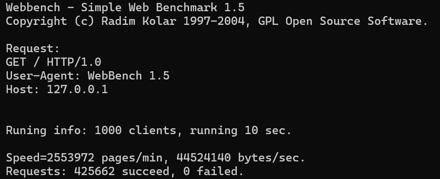

# 🚀 C++ 多线程高性能 Web 服务器

基于现代 C++20 编写的高性能 HTTP 服务器，采用 epoll 事件驱动 + 线程池任务调度架构，支持静态文件服务、动态请求处理与优雅连接管理，提供完善的日志系统和模块化配置能力。

## ✨ 核心功能

- 🚄 **高并发处理**：基于 epoll 边缘触发（ET）模式，经 WebBench 压测，QPS 可达 **42,566**。
- 🧰 **线程池调度**：动态任务分发与异常捕获，提升资源利用率。
- 📦 **静态托管**：自动识别 MIME 类型，支持目录索引与安全校验。
- 📝 **动态解析**：处理 GET / POST 请求，支持表单数据提取与结构化响应。
- 📊 **分级日志**：DEBUG / INFO / WARNING / ERROR 四级日志，按日轮换文件。
- ⚙️ **启动时配置**：通过 `config.ini` 初始化端口、线程数等参数。
- 🔒 **安全防护**：路径规范化检查，Linger 模式控制连接行为，防止目录遍历攻击。

## 📂 项目架构

```
WebServer/
├── docs/
│   ├── core/           # 核心类相关的文档
│   ├── images/         # 存放文档的图片
│   └── utils/          # 工具类相关的文档
│
├── include/
│   ├── core/           # 核心类头文件
│   └── utils/          # 工具类头文件
│
├── src/
│   ├── core/           # 核心类源文件
│   └── utils/          # 工具类源文件
│
├── static/             # 存放静态文件（HTML、CSS、JS、图片等）
├── CMakeLists.txt      # CMake 配置文件，用于构建项目
├── config.ini          # 服务器配置文件
├── LICENSE             # 项目的开源许可证文件
├── main.cpp            # 主程序入口
└── README.md           # 项目的自述文件，包含项目信息、使用指南等
```

## 🖥️ 测试环境

- **操作系统**：Ubuntu 24.04.2 LTS
- **编译器**：g++ 13.3.0
- **构建工具**：CMake 3.28.3
- **压测工具**：WebBench 1.5

## 🛠️ 构建指南

### 依赖项
- g++ (>= 13)
- CMake (>= 3.13)

### 编译命令
```bash
mkdir build && cd build
cmake .. -DCMAKE_BUILD_TYPE=Release
make -j$(nproc)
```

### 启动服务
```bash
./WebServer
```

## ⚙️ 配置示例

编辑 `config.ini` 调整参数：

```ini
# 监听端口（默认为 8080）
port = 8080

# 日志级别（DEBUG/INFO/WARNING/ERROR）
log_level = DEBUG

# 线程池大小（默认为 4）
thread_count = 4

# 是否启用 Linger 模式（默认为关闭）
linger = false
```

## 🌟 功能示例

### 1. 静态资源
- **默认首页**：访问 `http://localhost:8080/index.html` 返回欢迎页面。
- **表单测试页**：访问 `http://localhost:8080/form.html` 提交 POST 请求。

### 2. 目录索引
- **自动生成列表**：访问目录路径（如 `http://localhost:8080/images/`）时，生成 HTML 文件列表：
  - 显示文件名、大小、修改时间。
  - 支持点击目录跳转（如 `jpg/` -> `/images/jpg/`）。
  - 自动补全斜杠（如 `/images` -> 重定向至 `/images/`）。


### 3. 表单处理
- **提交示例**：
  ```html
  <form method="POST" action="/submit">
      <input type="text" name="name" value="张三">
      <input type="email" name="email" value="zhangsan@example.com">
      <textarea name="message">这是一个测试留言</textarea>
  </form>
  ```
- **响应结果**：
  ```plaintext
  Received POST data:
      name = 张三
      email = zhangsan@example.com
      message = 这是一个测试留言
  ```

### 4. 错误处理
- **403 Forbidden**：路径越权访问（如 `../../../etc/passwd`）。
- **404 Not Found**：请求文件不存在时返回友好错误页。

## 📈 性能评测

### 压测配置
- **日志级别**：WARNING（减少 I/O 开销）
- **Linger 模式**：关闭
- **测试工具**：WebBench 1.5
- **并发连接**：1000
- **测试时长**：10 秒

### 测试结果
- **QPS**：42,566
- **截图**：[压测结果](./docs/images/webbench_result.png)



## 📄 开源许可

本项目基于 **[MIT License](./LICENSE)** 开源，可自由用于个人或商业用途。
